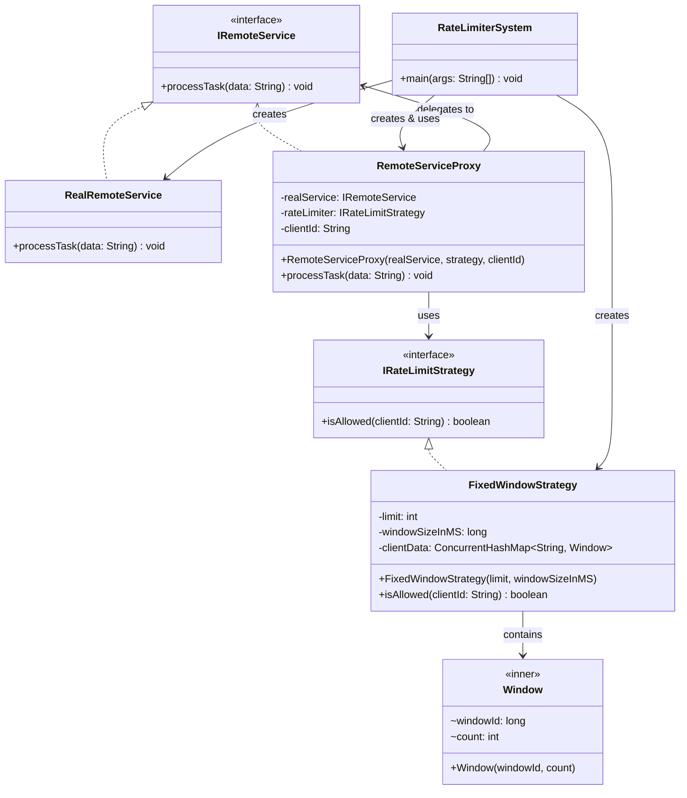

# Rate Limiter System

A Java implementation of a **Rate Limiter** using the **Proxy Design Pattern** and the **Strategy Design Pattern**. It controls how frequently a client can call a remote service within a defined time window.

---

## Class Diagram



---

## Design Patterns Used

### 1. Proxy Pattern
`RemoteServiceProxy` wraps `RealRemoteService` and intercepts every `processTask()` call to enforce rate limiting before delegating to the real service.

### 2. Strategy Pattern
`IRateLimitStrategy` is an interface that decouples the rate limiting algorithm from the proxy. Different strategies (e.g., Fixed Window, Sliding Window, Token Bucket) can be swapped in without changing the proxy.

---

## Project Structure

```
src/
├── controller/
│   └── RateLimiterSystem.java       # Entry point
├── interfaces/
│   ├── IRateLimitStrategy.java      # Strategy contract
│   └── IRemoteService.java          # Service contract
├── proxy/
│   └── RemoteServiceProxy.java      # Proxy with rate limiting
├── services/
│   └── RealRemoteService.java       # Actual service implementation
└── strategies/
    └── FixedWindowStrategy.java     # Fixed window rate limit algorithm
```

---

## How It Works

The **Fixed Window Strategy** divides time into fixed windows (e.g., 1000 ms). Each client gets a maximum number of allowed requests per window. When a new window begins, the counter resets.

| Request | Time       | Result              |
|---------|------------|---------------------|
| Hit 1   | t = 0ms    | ✅ Allowed           |
| Hit 2   | t ≈ 0ms    | ❌ 429 Too Many Requests |
| Hit 3   | t = 1000ms | ✅ Allowed (new window) |

---

## Usage

```java
// Create a strategy: 1 request per 1000ms window
IRateLimitStrategy fixedWindow = new FixedWindowStrategy(1, 1000);

// Wrap real service with proxy
IRemoteService proxy = new RemoteServiceProxy(
    new RealRemoteService(),
    fixedWindow,
    "User123"
);

proxy.processTask("Data A"); // Allowed
proxy.processTask("Data B"); // Blocked — 429 error
```

---

## Extending the System

To add a new rate limiting algorithm, simply implement `IRateLimitStrategy`:

```java
public class SlidingWindowStrategy implements IRateLimitStrategy {
    @Override
    public boolean isAllowed(String clientId) {
        // your sliding window logic
    }
}
```

No changes to `RemoteServiceProxy` or any other class are needed.
