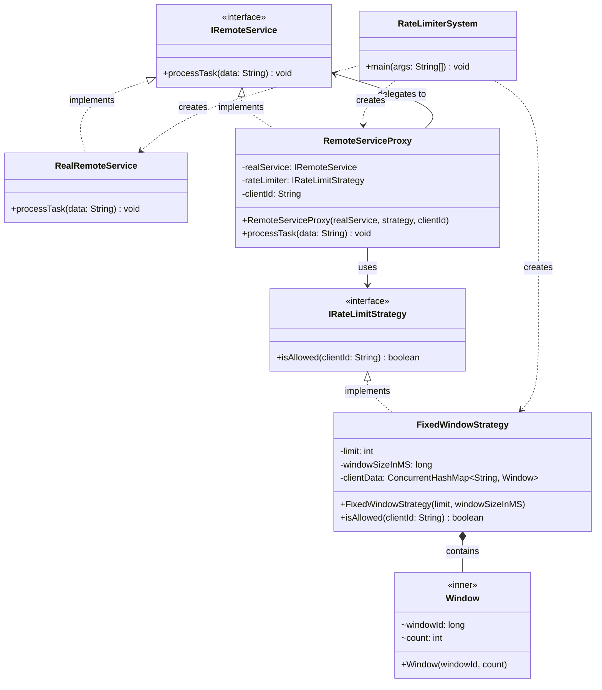

# Rate Limiter System

A Java implementation of a **Rate Limiter** using the **Proxy** and **Strategy** design patterns. The system controls how many requests a client can make to a remote service within a time window, returning an HTTP 429-style error when the limit is exceeded.

---

## Architecture

### Design Patterns Used

- **Proxy Pattern** — `RemoteServiceProxy` sits in front of `RealRemoteService`, intercepting calls and enforcing rate limits transparently.
- **Strategy Pattern** — `IRateLimitStrategy` decouples the rate-limiting algorithm from the proxy, making it easy to swap strategies (Fixed Window, Sliding Window, Token Bucket, etc.) without changing the proxy.

---

## Class Diagram



---

## Package Structure

```
src/
├── controller/
│   └── RateLimiterSystem.java       # Entry point / wiring
├── interfaces/
│   ├── IRateLimitStrategy.java      # Strategy contract
│   └── IRemoteService.java          # Service contract
├── proxy/
│   └── RemoteServiceProxy.java      # Proxy with rate-limit enforcement
├── services/
│   └── RealRemoteService.java       # Actual service implementation
└── strategies/
    └── FixedWindowStrategy.java     # Fixed Window rate-limit algorithm
```

---

## How It Works

### Fixed Window Algorithm

Time is divided into fixed buckets of `windowSizeInMS` milliseconds. Each client gets a fresh counter at the start of every window. If the counter reaches `limit`, all further requests in that window are denied.

```
Window 1 (0–1000ms)     Window 2 (1000–2000ms)
┌──────────────────┐    ┌──────────────────┐
│  Request 1 ✅    │    │  Request 3 ✅    │
│  Request 2 ❌    │    │                  │
│  (limit = 1)     │    │  (counter reset) │
└──────────────────┘    └──────────────────┘
```

### Request Flow

```
Client
  │
  ▼
RemoteServiceProxy.processTask(data)
  │
  ├─ rateLimiter.isAllowed(clientId)
  │       │
  │       ├─ true  ──► RealRemoteService.processTask(data)
  │       │
  │       └─ false ──► Print "Error 429: Too many requests"
  │
  ▼
(done)
```

---

## Example Output

```
Hit 1:
Processing Date A on Remote Server...

Hit 2 (Immediate):
Error 429: Too much requests for Client: User123

Hit 3 (After 1 sec):
Processing Data C on Remote Server...
```

---

## Known Issues & Suggested Fixes

### 1. ⚠️ Race Condition in `FixedWindowStrategy` (Thread Safety)

The check-then-increment logic is not atomic:

```java
// ❌ Not thread-safe — two threads can both pass the check
if (window.count < limit) {
    window.count++;   // race condition here
    return true;
}
```

**Fix:** Use `AtomicInteger` for the counter:

```java
// In Window inner class
AtomicInteger count = new AtomicInteger(0);

// In isAllowed()
if (window == null || window.windowId != currentWindow) {
    Window newWindow = new Window(currentWindow);
    clientData.put(clientId, newWindow);
    return true;
}
return window.count.incrementAndGet() <= limit;
```

### 2. ⚠️ `Window` Fields Should Be `volatile`

`windowId` is read by multiple threads without synchronization.

```java
// Fix: mark fields volatile
private static class Window {
    volatile long windowId;
    AtomicInteger count;
}
```

### 3. 🧹 Memory Leak — `clientData` Never Evicts Old Entries

The `ConcurrentHashMap` grows unboundedly as new `clientId`s are added. Old `Window` objects get replaced on the next window tick, but the key stays in the map forever.

**Fix:** Use a `ScheduledExecutorService` to periodically evict stale entries, or cap the map size with an LRU cache.

### 4. 🔤 Typo in `RateLimiterSystem.java`

```java
proxy.processTask("Date A");  // ❌ should be "Data A"
```

---

## Extending with New Strategies

To add a new algorithm (e.g., Sliding Window, Token Bucket), simply implement `IRateLimitStrategy`:

```java
public class TokenBucketStrategy implements IRateLimitStrategy {
    @Override
    public boolean isAllowed(String clientId) {
        // token bucket logic here
    }
}
```

Then plug it into the proxy without changing any other class:

```java
IRateLimitStrategy tokenBucket = new TokenBucketStrategy(10, 1000);
IRemoteService proxy = new RemoteServiceProxy(realService, tokenBucket, "User123");
```

---

## Running the Demo

```bash
javac -d out src/**/*.java
java -cp out controller.RateLimiterSystem
```